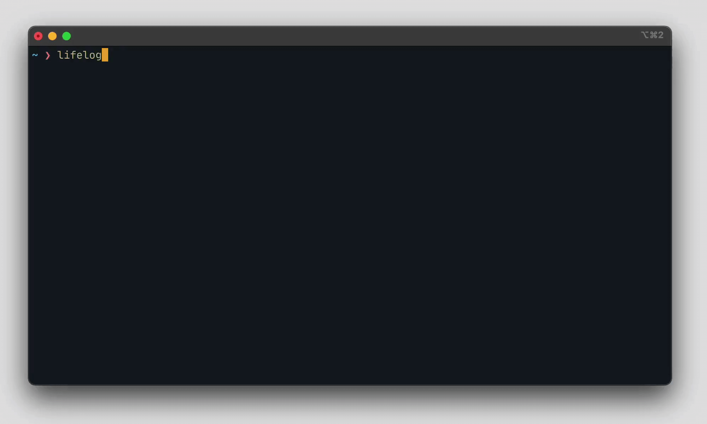

# lifelog

A simple diary that you can use from your terminal.



## Features

- Create one entry per day, in which you rate how your day went.
- Read/Update/Delete entries (this is just a simple CRUD app if you really think about it)
- View statistics for a given month (how many awesome/horrible days you had)
- Customization with a `.toml` file

## Install

You can download [an archived binary](https://github.com/DurbeKK/lifelog/releases) or use `cargo` to install `lifelog`:

```bash
cargo install xkpass
```

Alternatively, build from source:

```bash
cargo build --release
```

## QA

### Why rate specifically on a scale of -2 to +2?

Rating on this scale results in less biased ratings and normalizes having an average score of 0 (compared to the more popular '1 to 5' scale, where an average score of 3 is commonly considered bad). Heavily inspired by [a blog post](https://ihatereality.space/03-a-place-to-pause/), which itself was inspired by [another blog post](https://optozorax.github.io/p/5-point-ratings-are-wrong/).

### How do I customize the look of the program?

The program will look for a `theme.toml` file on startup in the following paths:

- `~/AppData/Roaming/lifelog/theme/theme.toml` (windows)
- `~/.local/share/lifelog/theme/theme.toml` (everywhere else)

If it fails to find a file, it will just use the default theme.
If it does find a file, but it proves to be invalid, the program will exit with an error.
More info on customization available [here](https://docs.rs/cursive/0.19.0/cursive/theme/index.html#configuring-theme-with-toml).

## License

`lifelog` is licensed under the terms of either the MIT license or the Apache License 2.0.
